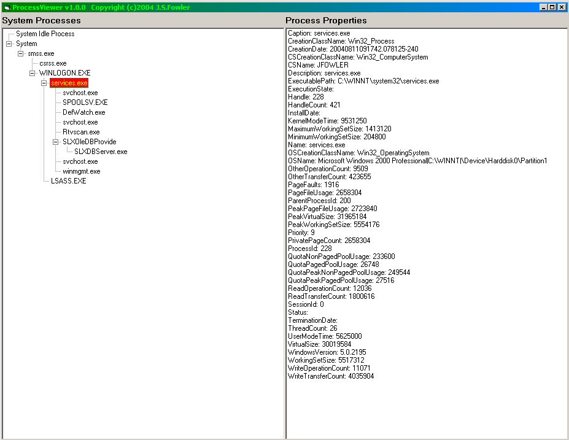



## WMI Process Viewer

### Description

Allows user to view all current win32 processes running on the system in a treeview with parent child relationships and click on a process to get extensive information on that process
 
### More Info
 
requires Windows Management Instrumentation (WMI) be installed on your system. This is automatically installed on Windows XP, Windows Server 2003 and Windows 2000.

             |
---                |---
**Submitted On**   |2004-08-11 16:38:08
**By**             |[John Fowler](https://github.com/Planet-Source-Code/PSCIndex/blob/master/ByAuthor/john-fowler.md)
**Level**          |Intermediate
**User Rating**    |5.0 (10 globes from 2 users)
**Compatibility**  |VB 6\.0
**Category**       |[Miscellaneous](https://github.com/Planet-Source-Code/PSCIndex/blob/master/ByCategory/miscellaneous__1-1.md)
**World**          |[Visual Basic](https://github.com/Planet-Source-Code/PSCIndex/blob/master/ByWorld/visual-basic.md)
**Archive File**   |[WMI\_Proces1780798112004\.zip](https://github.com/Planet-Source-Code/john-fowler-wmi-process-viewer__1-55511/archive/master.zip)

